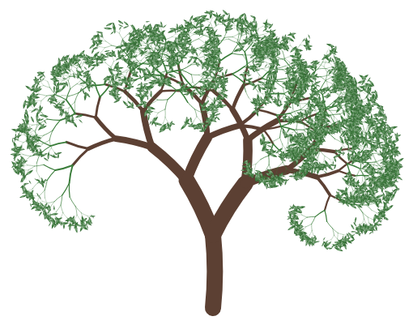

# fractal-canopy.js

[](https://github.com/nattrass/fractal-canopy.js/actions/workflows/ci.yml)

JavaScript library for rendering a [Fractal Canopy](https://en.wikipedia.org/wiki/Fractal_canopy) onto an HTML5 canvas.

**[Live playground](https://nattrass.github.io/fractal-canopy.js/playground/)** &mdash; adjust every option and watch the canopy redraw in real time.

> To surface this link from the repo's own page, add it to the GitHub repo's "About" section (the gear icon next to About on the repo homepage) as the website field &mdash; that has to be set manually, it isn't picked up from this README.



## About

A fractal canopy is a fractal structure that resembles a tree canopy. This library provides an easy way to generate and display these beautiful recursive patterns on an HTML5 canvas.

## Installation

```bash
npm install fractal-canopy
```

## Getting Started

### ESM / bundlers

```js
import { Canopy } from 'fractal-canopy';

const canvas = document.getElementById('canopy');
const ctx = canvas.getContext('2d');

const canopy = new Canopy(ctx);
canopy.RenderCanopy();
```

The package ships CommonJS and TypeScript types too, so `require('fractal-canopy')` and full autocomplete/type-checking both work out of the box.

### `<script>` tag / CDN

```html
<canvas id="canopy" height="400" width="800" style="background-color:#FFF;"></canvas>
<script src="https://cdn.jsdelivr.net/npm/fractal-canopy/dist/fractal-canopy.min.js"></script>
<!-- or: https://unpkg.com/fractal-canopy/dist/fractal-canopy.min.js -->
<script>
    var canvas = document.getElementById('canopy');
    var ctx = canvas.getContext('2d');

    var canopy = new FractalCanopy.Canopy(ctx);
    canopy.RenderCanopy();
</script>
```

> **Note:** as of `0.2.0` the browser build exposes a `FractalCanopy` namespace global (`FractalCanopy.Canopy`) instead of a bare `Canopy` global.

### Basic Usage

1. Create an instance of `Canopy`, passing in a canvas 2D context
2. Call `RenderCanopy()` on the Canopy object to draw the fractal canopy

### Options

`Canopy` takes an optional second argument to override any of the defaults.
Anything you leave out keeps its default value.

```js
const canopy = new Canopy(ctx, {
    originX: 200,
    originY: 400,
    maxDepth: 9,
    leafColor: 'Orange'
});
canopy.RenderCanopy();
```

| Option | Default | Description |
| --- | --- | --- |
| `originX` / `originY` | `400` / `400` | Point the trunk grows from |
| `startAngle` | `Math.PI` | Direction the trunk grows in, in radians |
| `trunkLength` / `trunkWidth` | `100` / `20` | Size of the trunk |
| `branchLength` / `branchWidth` | `75` / `20` | Size of the first pair of branches |
| `lengthScale` / `widthScale` | `0.75` / `0.6` | How much each branch shrinks per depth |
| `branchSpread` | `2π / 11` | Angle between a pair of branches, in radians |
| `spreadJitter` | `1` | Maximum random extra spread, in radians |
| `gravity` | `0` | Bends branches toward straight down, scaled by depth so outer branches droop more than inner ones. `0` leaves the geometry untouched; positive values droop (willow-like); negative values exaggerate the upward lean instead |
| `maxDepth` | `11` | How many times the canopy forks |
| `leafDepth` | `5` | Depth at which branches switch to the leaf colour |
| `branchColor` / `leafColor` | `'Black'` / `'Green'` | Stroke colours |
| `lineCap` | `'round'` | Canvas line cap. Round fills the joint where a branch forks; `'butt'` leaves a visible step |
| `seed` | `undefined` | Makes the tree deterministic &mdash; see [Deterministic output](#deterministic-output) |

The defaults are exposed as `Canopy.defaults`.

### Deterministic output

By default every render is randomised (via `Math.random`), so the same options produce a different tree each time. Set `seed` to a string or number and every source of randomness comes from a seeded PRNG instead, so the *same* seed with the *same* options always produces the *exact same* tree, byte-for-byte:

```js
import { Canopy, presets } from 'fractal-canopy';

const canopy = new Canopy(ctx, { ...presets.cherryBlossom, seed: 'spring' });
canopy.RenderCanopy(); // always this exact tree, every time
```

Leave `seed` unset for the original random-every-time behaviour.

### Presets

`presets` is a set of named partial-`CanopyOptions` objects &mdash; each one only overrides the handful of options it needs, and is meant to be passed straight to `Canopy` as-is or as a starting point to tweak further:

```js
import { Canopy, presets } from 'fractal-canopy';

const canopy = new Canopy(ctx, presets.cherryBlossom);
canopy.RenderCanopy();
```

```html
<script>
    var canopy = new FractalCanopy.Canopy(ctx, FractalCanopy.presets.weepingWillow);
    canopy.RenderCanopy();
</script>
```

| Preset | Look |
| --- | --- |
| `classicOak` | Wide, balanced canopy with a gentle droop |
| `cherryBlossom` | Dense, pink-leaved, brown-branched |
| `bareWinter` | No leaves, thin gnarled branches |
| `weepingWillow` | Narrow, strong droop, muted green |
| `conifer` | Tall, narrow evergreen spire |
| `autumnBlaze` | `classicOak`'s shape in orange/amber |

Try them all in the [live playground](https://nattrass.github.io/fractal-canopy.js/playground/) via the Preset dropdown &mdash; picking one loads its values into every control so you can keep tweaking from there.

## Development

The library is written in TypeScript and built with [tsup](https://tsup.egoist.dev/), which emits ESM, CommonJS, a minified IIFE for `<script>`/CDN use, and `.d.ts` type declarations.

```bash
git clone https://github.com/nattrass/fractal-canopy.js.git
cd fractal-canopy.js
npm install
npm run build
```

- `npm run build` - Build ESM, CJS, IIFE and type declarations into `dist/`
- `npm run dev` - Rebuild on changes
- `npm run typecheck` - Type-check the project with `tsc --noEmit`

### Playground

`playground/index.html` is a plain HTML/CSS/JS page with a control for every `CanopyOptions` field. It loads the built IIFE from `../dist/`, so run `npm run build` first, then open the file directly in a browser &mdash; no dev server or build step required for the playground itself. It's also what's published to the [live Pages site](https://nattrass.github.io/fractal-canopy.js/playground/) on every push to `master` (see `.github/workflows/deploy-pages.yml`).

The playground's URL is always kept in sync with the current tree (only whatever differs from the defaults, or from the selected preset, is encoded &mdash; e.g. `#preset=cherryBlossom&seed=abc123`), and every render is seeded. That makes every URL shareable: copying it (via the "Copy link" button, or just the address bar) and opening it in a fresh tab reproduces the exact same tree, pixel-for-pixel, with every control populated to match. "Randomise" and picking a preset both set a concrete seed for exactly this reason; "New seed" generates a fresh one for a different tree in the same style.

## Testing

This project uses [Vitest](https://vitest.dev/) for unit testing:

- `npm test` - Run all tests
- `npm run test:watch` - Run tests in watch mode
- `npm run test:coverage` - Run tests with code coverage report

Test files are located in the `tests/` directory with the `.test.ts` extension.

## License

This project is licensed under the MIT License - see the [LICENSE](LICENSE) file for details

